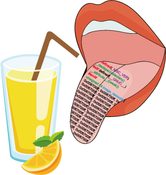

# I am too sour.


##### Change the image to the source file. These changed source files can be used as resources. This repository contains examples of conversion to cv:::Mat and HBITMAP.

### Usage
```
Convert image to source code.
Usage: iats [params] image variable file width height

        -?, -h, --help
                help me

        image
                input image file
        variable (value:image_resource)
                variable name
        file (value:image.h)
                destination file
        width (value:0)
                image width
        height (value:0)
                image height
```

You can omit width and height. If you omit all of them, the original size is printed. If you omit one, the remaining length is adjusted according to the ratio.


### Example

```bash
iats.exe empire.jpg image_empire image.h
```

### Download

#### [iats.exe](https://github.com/springkim/i-am-too-sour/releases/download/1.0/iats.exe)